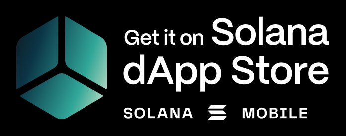
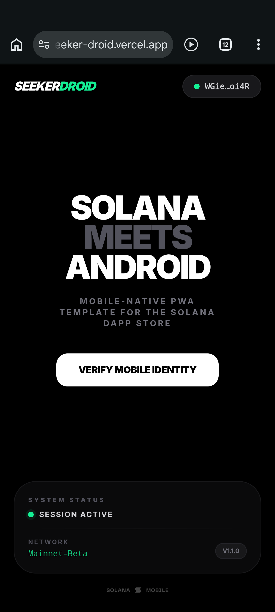
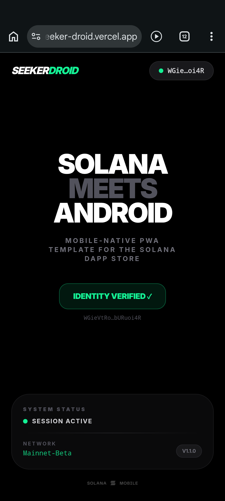
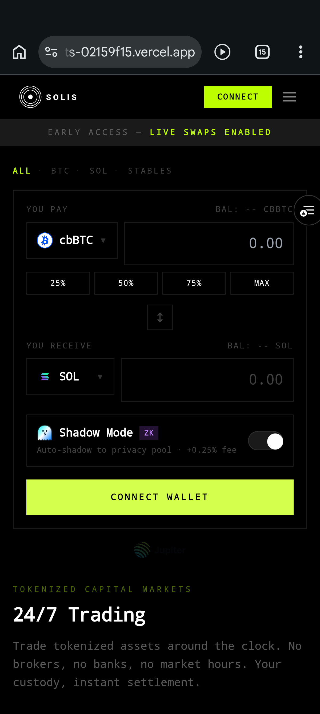
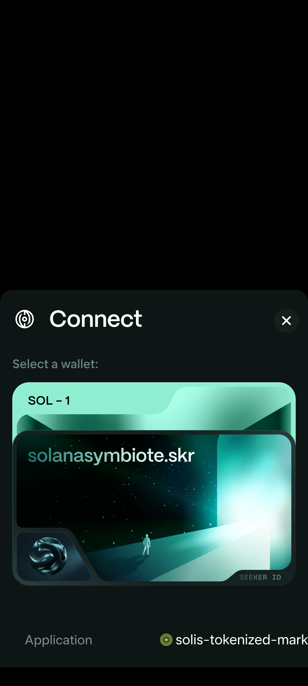
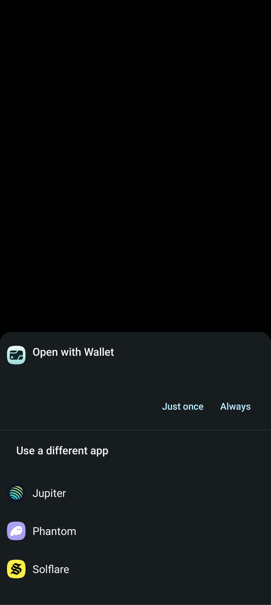
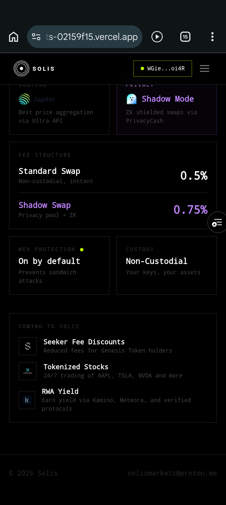
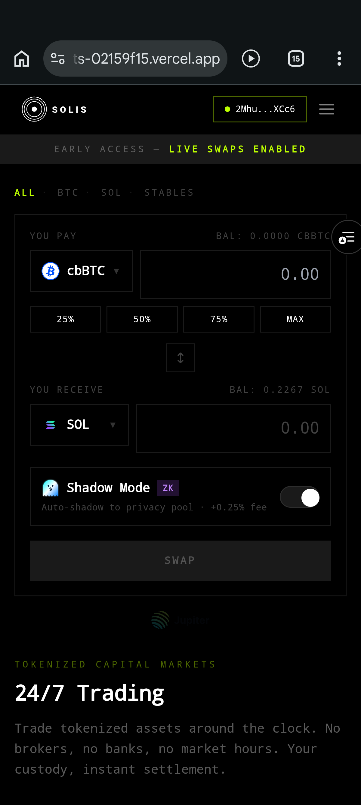

# SeekerDroid

**The production-ready PWA → dApp Store template for Solana Seeker.**

A mobile-optimized Next.js 15 Progressive Web App with Trusted Web Activity (TWA) packaging, built specifically for the Solana Mobile dApp Store. SeekerDroid demonstrates the complete pipeline from web app to installable Android APK using Bubblewrap CLI, with reliable Mobile Wallet Adapter (MWA) integration and mobile-native UX patterns.

[](https://seeker-droid.vercel.app)

> **Live Demo:** [seeker-droid.vercel.app](https://seeker-droid.vercel.app) — Open on Android Chrome or Solana Seeker

---

## Screenshots

<p align="center">
  
  &nbsp;&nbsp;&nbsp;
  
</p>

<p align="center">
  <em>Left: Wallet connected via MWA — Right: Identity verified with on-device signMessage</em>
</p>

---

## What This Template Solves

Publishing a PWA on the Solana dApp Store requires converting your web app to an Android package via Bubblewrap CLI. The process works, but developers face several undocumented pitfalls:

- **MWA connection failures** — Android Chrome's [trusted event policy](https://developer.chrome.com/docs/android/intents) silently blocks wallet connections triggered from `useEffect` or timers instead of direct user taps
- **Splash screen and icon misconfiguration** — TWA manifests and PWA manifests need consistent theming, local assets, and separate maskable icon entries
- **Missing Digital Asset Links** — Without `assetlinks.json` and SHA-256 fingerprint verification, the TWA shows a browser address bar instead of running in full-screen trusted mode
- **Non-mobile UX patterns** — Desktop wallet-selection modals don't work on mobile; Android users need bottom-sheet drawers and direct MWA selection
- **`WalletModalProvider` conflicts** — The standard wallet-adapter modal intercepts MWA connections on Android, requiring apps to either bypass it or use a direct connect flow
- **Bubblewrap `app/` directory conflict** — `bubblewrap build` creates an `app/` directory that collides with Next.js App Router's `src/app/`, causing 404 errors on deploy

SeekerDroid solves all of these and serves as a copy-paste starting point for any Solana PWA targeting the dApp Store.

---

## Features

### MWA Integration (Wallet Standard)

- Uses `@solana-mobile/wallet-standard-mobile` — the recommended library going forward as `wallet-adapter-mobile` enters deprecation
- **No `autoConnect`** — all wallet interactions are user-initiated to comply with Android Chrome's trusted event policy
- **MWA-first connect flow** — detects MWA availability and connects directly without showing a modal, per [Solana Mobile UX Guidelines](https://docs.solanamobile.com)
- **"Use Installed Wallet" labeling** — follows official UX guidance for the MWA wallet list entry
- **User-initiated `signMessage`** — verification is a separate button tap, never auto-triggered from effects
- **No `WalletModalProvider` dependency** — uses a custom bottom-sheet drawer instead of the desktop modal, avoiding the most common MWA integration issue

### Mobile-Native UX

- **Bottom-sheet wallet drawer** — powered by [Vaul](https://github.com/emilkowalski/vaul), the mobile-standard interaction pattern replacing desktop modals
- **Safe area handling** — respects `env(safe-area-inset-*)` for notch/dynamic island devices and uses `100dvh` for correct mobile viewport height
- **Touch-optimized interactions** — `active:scale-95` press feedback, large tap targets, no hover-dependent UI
- **No-scroll single-screen layout** — the entire app fits the viewport without scrolling, as expected for a mobile utility app

### TWA / Bubblewrap Pipeline

- **Complete `twa-manifest.json`** — configured for Bubblewrap CLI with consistent theming, local icon URLs, Chrome Custom Tabs fallback, and portrait orientation lock
- **Digital Asset Links** — `public/.well-known/assetlinks.json` pre-configured for TWA trusted full-screen mode
- **Splash screen** — custom branded icons (192×192 + 512×512, regular and maskable) with consistent `#000000` background across both manifests
- **Chrome-first, system fallback** — `fallbackType: "customtabs"` ensures Chrome is preferred with graceful degradation

### PWA Configuration

- **Service worker** via `@ducanh2912/next-pwa` with aggressive frontend nav caching
- **Proper manifest** with separate `any` and `maskable` icon entries (not combined — Android treats them differently)
- **Apple web app meta** — `capable: true`, `black-translucent` status bar, viewport cover mode

---

## Quick Start

### Prerequisites

- Node.js 18+
- Android device or emulator (MWA only works on Android Chrome)
- A Solana wallet installed on the device (Phantom, Solflare, or Seed Vault)

### 1. Clone and install

```bash
git clone https://github.com/deFiFello/seeker-droid.git
cd seeker-droid
npm install
```

### 2. Run locally

```bash
npm run dev
```

Open `http://localhost:3000` — the MWA connect flow will only work on Android Chrome, but you can verify the UI and build process on desktop.

### 3. Deploy

The app is configured for Vercel:

```bash
npm run build
# Deploy to Vercel, Netlify, or any static host
```

### 4. Build the TWA (Android APK)

```bash
# Install Bubblewrap CLI
npm install -g @bubblewrap/cli

# Generate your signing keystore (if you don't have one)
keytool -genkeypair -alias android -keyalg RSA -keysize 2048 -validity 10000 -keystore android.keystore

# Get your SHA-256 fingerprint
keytool -list -keystore android.keystore -alias android | grep SHA256

# Update twa-manifest.json with your fingerprint in the "fingerprints" array
# Update public/.well-known/assetlinks.json with the same fingerprint

# Build
bubblewrap update
bubblewrap build
```

> **⚠️ Important:** `bubblewrap build` creates an `app/` directory in your project root that conflicts with Next.js App Router (which uses `src/app/`). Delete it after building: `rm -rf app/` — otherwise your Next.js build will output only a 404 page.

This produces `app-release-signed.apk` and `app-release-bundle.aab` ready for dApp Store submission.

---

## Integration Guide: Adding MWA to an Existing App

SeekerDroid's MWA pattern was tested on **[Solis](https://solis-tokenized-markets.vercel.app)** — a production Solana trading platform with Jupiter swaps, PrivacyCash ZK privacy, and 14 tokenized assets. Here's how the integration works and the pitfalls we solved.

### The Pattern

The core integration is three things:

**1. Register MWA in a non-SSR context**

```typescript
import { registerMwa } from '@solana-mobile/wallet-standard-mobile';

if (typeof window !== 'undefined') {
  registerMwa({
    appIdentity: {
      name: 'Your App',
      uri: 'https://yourapp.com',
      icon: '/icon.png',
    },
    authorizationCache: createDefaultAuthorizationCache(),
    chains: ['solana:mainnet'],
    chainSelector: createDefaultChainSelector(),
    onWalletNotFound: createDefaultWalletNotFoundHandler(),
  });
}
```

**2. Set `autoConnect: false`**

```typescript
<WalletProvider wallets={wallets} autoConnect={false}>
```

**3. Bypass the modal on Android — connect MWA directly from a user tap**

```typescript
const handleConnect = async () => {
  if (wallet?.adapter.name === SolanaMobileWalletAdapterWalletName) {
    await connect(); // Direct MWA connect — user gesture required
  } else if (mwaAvailable) {
    select(SolanaMobileWalletAdapterWalletName);
  } else {
    showDesktopModal(); // Fallback for non-Android
  }
};
```

### Common Pitfalls (Solved)

| Issue | Cause | Fix |
|---|---|---|
| "Can't find a wallet" | `autoConnect: true` or `signMessage` in `useEffect` | Set `autoConnect: false`, only call wallet methods from `onClick` handlers |
| Modal pops up instead of MWA | `WalletModalProvider` intercepts before MWA fires | Check for MWA first, only fall through to modal on desktop |
| `wallet-standard-mobile@0.5.0-beta2` build fails | `startScenario` export missing in protocol package | Pin to `@0.4.4` for React 18 apps, or use latest for React 19 |
| `@solana-mobile/wallet-adapter-mobile` conflicts | Deprecated package registers MWA twice | Remove it — `wallet-standard-mobile` replaces it entirely |
| Double sign prompts | Both button component and page component call `signMessage` | Pick one location for sign logic |

### Solis Integration — Proof on Seeker Hardware

The SeekerDroid MWA pattern was integrated into Solis's early access branch. The following screenshots show it working on a Solana Seeker device:

<p align="center">
  
  &nbsp;
  
  &nbsp;
  
</p>

<p align="center">
  <em>Left: Swap page before connect — Center: MWA triggers Seed Vault directly — Right: Wallet selection via Seed Vault</em>
</p>

<p align="center">
  
  &nbsp;
  
</p>

<p align="center">
  <em>Left: Connected with live balances — Right: Full swap interface with fee structure</em>
</p>

**What changed in Solis to enable MWA:**

1. Added `registerMwa()` in `SolanaProvider.tsx` (5 lines)
2. Set `autoConnect: false` (1 line)
3. Created `useConnect` hook that checks for MWA before falling back to the desktop modal (15 lines)
4. Replaced `setVisible(true)` calls with `triggerConnect()` in Header and Swap page (3 lines each)
5. Removed deprecated `@solana-mobile/wallet-adapter-mobile` package

Total diff: ~30 lines changed across 4 files. No UI redesign needed.

---

## Project Structure

```
├── src/
│   ├── app/
│   │   ├── layout.tsx          # Root layout, viewport config, SolanaProvider wrapper
│   │   ├── page.tsx            # Main screen with verify flow
│   │   └── globals.css         # Tailwind v4
│   └── components/
│       ├── SolanaProvider.tsx   # MWA registration + wallet context (autoConnect: false)
│       └── WalletButton.tsx    # MWA-first connect, bottom-sheet fallback
├── public/
│   ├── manifest.json           # PWA manifest with local icons
│   ├── icons/                  # App icons (192, 512, maskable variants)
│   ├── favicon.ico
│   └── .well-known/
│       └── assetlinks.json     # Digital Asset Links for TWA verification
├── twa-manifest.json           # Bubblewrap CLI config
├── build.gradle                # Generated TWA build script
└── package.json
```

---

## Key Technical Decisions

### Why `autoConnect: false`?

MWA on Android Chrome requires all wallet interactions to originate from a **user gesture** (tap, click). Setting `autoConnect: true` causes the wallet adapter to attempt connection on page load inside a `useEffect`, which Android blocks as an untrusted navigation. This is the most common source of the "We can't find a wallet" error.

### Why no `WalletModalProvider`?

The default `@solana/wallet-adapter-react-ui` modal is designed for desktop browsers with many wallet extensions. On Android, MWA is typically the only option. SeekerDroid replaces the modal with a bottom-sheet drawer that only appears when MWA isn't available, and directly connects to MWA when it is — eliminating an unnecessary tap.

For apps that need to keep `WalletModalProvider` (e.g., they already have desktop users), the `useConnect` hook pattern demonstrated in the Solis integration bypasses the modal on Android while preserving it on desktop.

### Why `signMessage` isn't called in `useEffect`?

Android Chrome's [trusted event policy](https://developer.chrome.com/docs/android/intents) blocks MWA intent navigation from programmatic triggers. Even wrapping `signMessage` in a `setTimeout` inside a `useEffect` doesn't count as a user gesture. The only reliable pattern is calling it from a direct `onClick` handler.

### Why separate `any` and `maskable` icons?

Android applies different cropping to maskable icons (circular safe zone). Combining `"purpose": "any maskable"` on a single icon causes the regular icon to be cropped incorrectly on some launchers. SeekerDroid provides dedicated entries for each purpose.

### Why delete `app/` after `bubblewrap build`?

Bubblewrap generates an Android project with an `app/` module directory at the project root. Next.js App Router interprets any root-level `app/` directory as the application routes, ignoring `src/app/` entirely. This causes the build to output only a 404 page with no actual routes. The fix is simple: `rm -rf app/` after building the APK.

---

## Compatibility

| Environment | Status | Notes |
|---|---|---|
| Solana Seeker | ✅ | Primary target — tested with Seed Vault |
| Android + Chrome | ✅ | Any Android device with a Solana wallet |
| Android + Firefox/Brave | ❌ | MWA requires Chrome intents |
| iOS | ❌ | MWA is Android-only |
| Desktop browsers | ⚠️ | UI renders but MWA connect is unavailable |

---

## Bounty Deliverables

This project targets the **Solana Mobile PWA Improved** bounty ($5,000 USDC):

| Requirement | Implementation |
|---|---|
| Sample PWA using Bubblewrap CLI/template | Next.js 15 PWA with complete `twa-manifest.json`, Gradle build pipeline, signed APK/AAB output |
| Improved splash screen styling | Custom branded icons (regular + maskable), consistent `#000000` theming across both manifests, 300ms fade-out |
| Default to Chrome browser, fall back to system default | `"fallbackType": "customtabs"` in TWA config |
| Mobile-intuitive navigation and layouts | Bottom-sheet wallet drawer, safe area handling, touch feedback, single-screen viewport layout, MWA-first connect flow |
| MWA reliability | Wallet Standard library, user-initiated actions only, no `autoConnect`, proper trusted event compliance |
| **Proof of integration** | MWA pattern tested on [Solis](https://solis-tokenized-markets.vercel.app) — a production trading app with 14 assets, Jupiter swaps, and ZK privacy |

---

## Tech Stack

- **Framework:** Next.js 15 (App Router)
- **Wallet:** `@solana-mobile/wallet-standard-mobile` + `@solana/wallet-adapter-react`
- **Styling:** Tailwind CSS v4
- **UI:** Vaul (bottom sheet), Lucide React (icons)
- **PWA:** `@ducanh2912/next-pwa`
- **TWA:** Bubblewrap CLI + Gradle
- **Deploy:** Vercel

---

## License

MIT

---

<p align="center">
  Built for the Solana Mobile dApp Store<br/>
  <strong><a href="https://seeker-droid.vercel.app">seeker-droid.vercel.app</a></strong>
</p>
