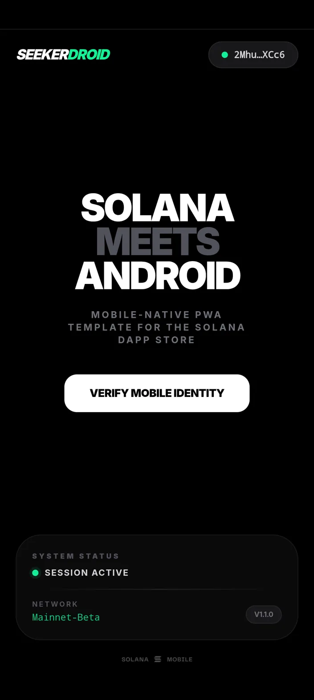
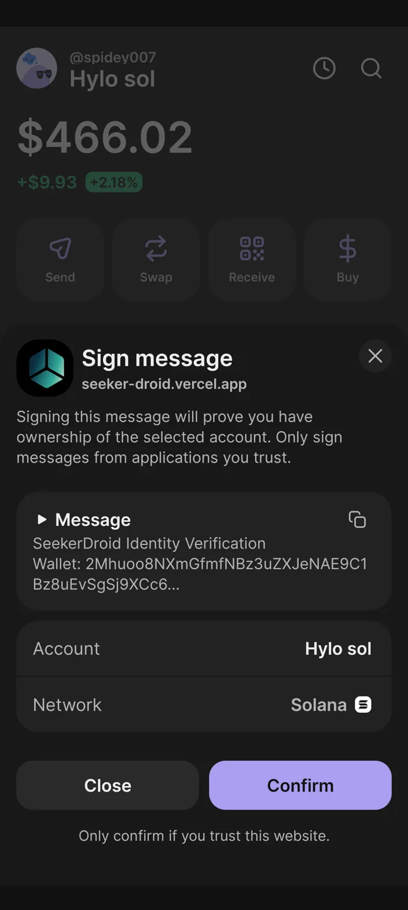
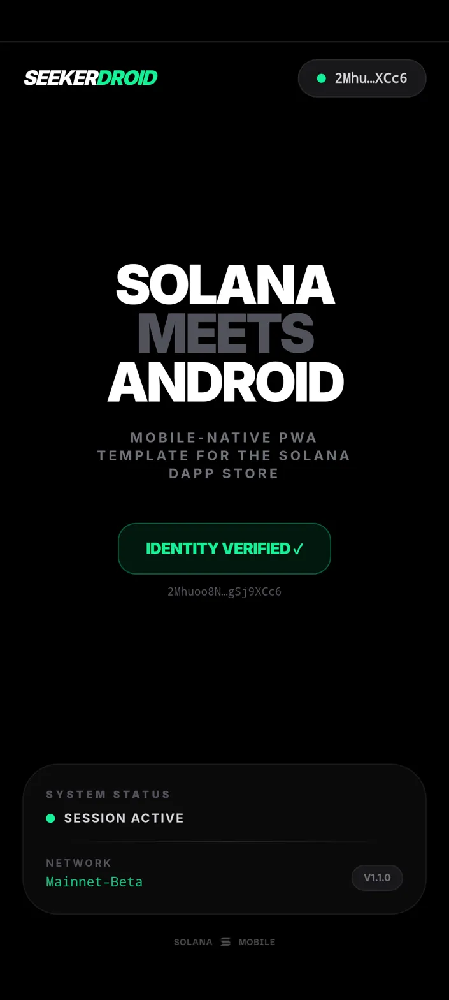
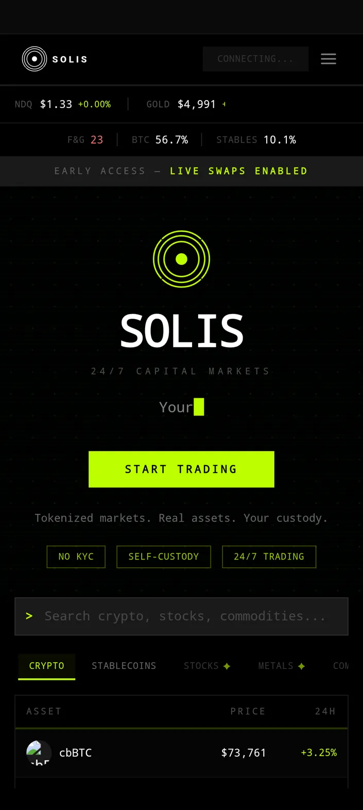
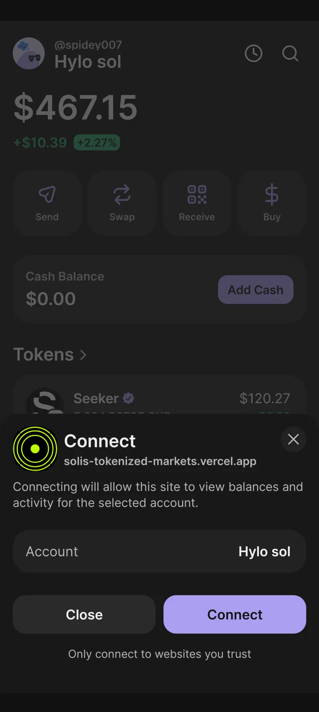
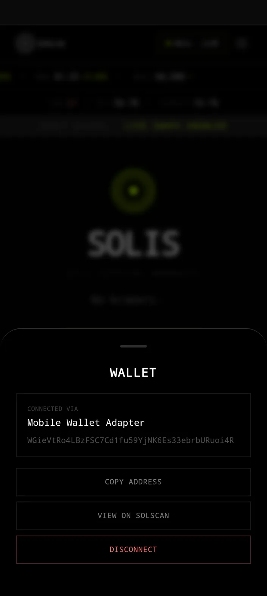
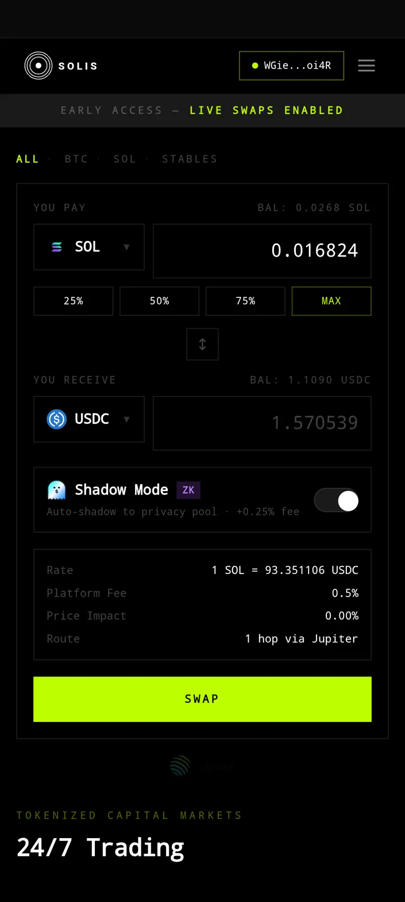
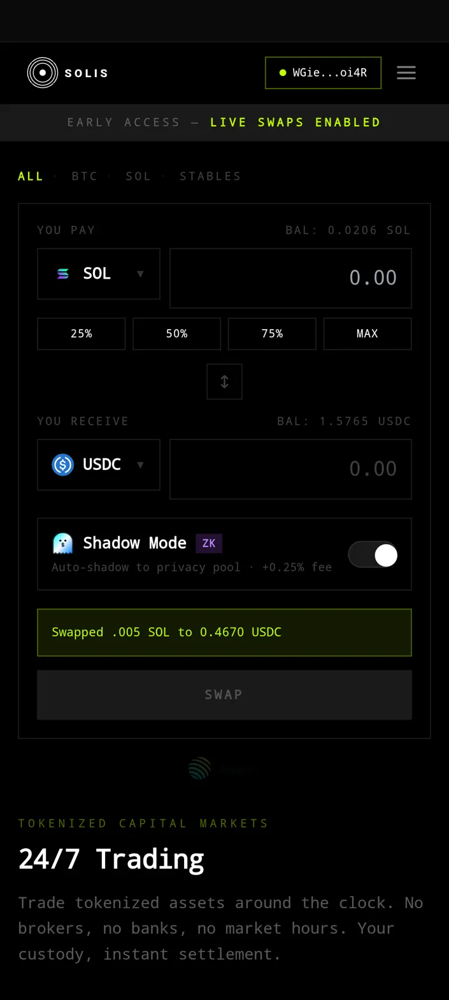
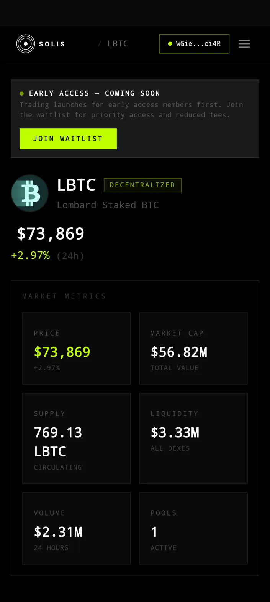

# SeekerDroid

**Mobile-native PWA template for the Solana dApp Store.**

A production-ready Next.js 15 template that packages any Solana web app as a Trusted Web Activity (TWA) for the Seeker device and the Solana dApp Store. Includes Mobile Wallet Adapter (MWA) integration, bottom-sheet wallet UX, identity verification, and full Bubblewrap TWA packaging.

**Live:** [seeker-droid.vercel.app](https://seeker-droid.vercel.app)

---

## What This Template Does

SeekerDroid solves the gap between "I have a Solana web app" and "I have a native-feeling app in the Solana dApp Store." It provides:

- **PWA scaffolding** — `manifest.json`, service worker, maskable icons
- **MWA integration** — `@solana-mobile/wallet-standard-mobile` with proper SSR guards for Next.js
- **Mobile-first wallet UX** — Bottom-sheet wallet picker, direct `connect()` on Android (no modal), 8-second timeout for stuck Seed Vault connections
- **TWA packaging** — Bubblewrap config, Digital Asset Links, signed APK generation
- **Seeker-optimized** — Full-screen launch, Seed Vault + Phantom + Solflare support, identity verification flow

---

## Hardware-Tested on Solana Seeker

Every feature has been tested on actual Seeker hardware. Screenshots below show the real device running both SeekerDroid and [Solis](https://solis-early-access.vercel.app) (a production trading app wrapped using this template).

### SeekerDroid — TWA Launch (Full-Screen, No Browser Bar)



The app launches from the Seeker home screen in full-screen mode with no browser chrome. This is achieved through the TWA trust relationship established by `assetlinks.json`.

### SeekerDroid — MWA Wallet Selection


Tapping "Connect" triggers the Android wallet chooser via MWA. All installed MWA-compatible wallets appear: Seed Vault, Phantom, Solflare, Jupiter.

### SeekerDroid — Connected + Identity Verification

| Session Active | Sign Message Prompt | Identity Verified |
|---|---|---|
|  |  |  |

The full flow: wallet connects → address displayed → sign message prompt fires from `seeker-droid.vercel.app` → identity verified with wallet address.

### Solis — Real App Wrapped with SeekerDroid's Pattern

To prove the template works beyond a demo, we wrapped [Solis](https://solis-early-access.vercel.app) — a production Solana trading app with live Jupiter swaps, ZK privacy (PrivacyCash), and tokenized asset data.

| Solis TWA Home | Seed Vault Connect | Wallet Bottom Sheet |
|---|---|---|
|  |  |  |

| Connected Swap UI | Successful Swap | Asset Detail (LBTC) |
|---|---|---|
|  |  |  |

**Time to wrap Solis:** Under 1 hour. The process was: add `manifest.json` + `sw.js` + icons → register service worker → `bubblewrap init` → `bubblewrap build` → deploy `assetlinks.json` → sideload APK.

---

## Quick Start — Use This Template

### Prerequisites

- Node.js 18+
- Java JDK 17+ (for Bubblewrap/Gradle)
- A deployed HTTPS web app (Vercel, Netlify, etc.)

### 1. Clone and install

```bash
git clone https://github.com/deFiFello/seeker-droid.git
cd seeker-droid
npm install
```

### 2. Configure for your app

Update `src/components/SolanaProvider.tsx` with your app identity:

```typescript
registerMwa({
  appIdentity: {
    name: 'Your App Name',
    uri: 'https://your-app.vercel.app',
    icon: '/icons/icon-192x192.png',
  },
  authorizationCache: createDefaultAuthorizationCache(),
  chains: ['solana:mainnet', 'solana:devnet'],
  chainSelector: createDefaultChainSelector(),
  onWalletNotFound: createDefaultWalletNotFoundHandler(),
});
```

### 3. Deploy

```bash
npm run build
# Push to Vercel, Netlify, or any HTTPS host
```

### 4. Wrap as TWA

```bash
npm install -g @nicolo-ribaudo/bubblewrap

mkdir my-twa && cd my-twa
bubblewrap init --manifest https://your-app.vercel.app/manifest.json
bubblewrap build
```

### 5. Set up Digital Asset Links

After building, get your signing key fingerprint:

```bash
keytool -list -v -keystore android.keystore -alias android | grep SHA256
```

Create `public/.well-known/assetlinks.json`:

```json
[{
  "relation": ["delegate_permission/common.handle_all_urls"],
  "target": {
    "namespace": "android_app",
    "package_name": "your.package.name.twa",
    "sha256_cert_fingerprints": ["YOUR:SHA256:FINGERPRINT:HERE"]
  }
}]
```

Deploy, then sideload the APK:

```bash
adb install app-release-signed.apk
```

Or upload to Google Drive and install from the phone.

---

## Wrapping Your Own App — Step by Step

For a detailed walkthrough of wrapping an existing Solana web app (using Solis as the example), see **[TWA-GUIDE.md](TWA-GUIDE.md)**.

The guide covers:

1. **Adding PWA support** — manifest, service worker, icons, SW registration in Next.js
2. **Adding MWA support** — installing `@solana-mobile/wallet-standard-mobile`, registering in a non-SSR context
3. **Wrapping with Bubblewrap** — init, build, signing key, Digital Asset Links
4. **Testing on Seeker** — sideloading, verifying full-screen mode, testing wallet flows

---

## Architecture

```
src/
├── app/
│   ├── layout.tsx          # Root layout with SolanaProvider + SW registration
│   ├── page.tsx            # Landing page with connect CTA
│   └── globals.css
├── components/
│   ├── SolanaProvider.tsx  # MWA registration + wallet-adapter setup
│   ├── WalletButton.tsx    # Bottom-sheet wallet UX with timeout recovery
│   └── RegisterSW.tsx      # Service worker registration (client component)
public/
├── manifest.json           # PWA manifest
├── sw.js                   # Network-first service worker
├── icons/                  # Standard + maskable icons (192, 512)
└── .well-known/
    └── assetlinks.json     # Digital Asset Links for TWA trust
```

### Key Design Decisions

**MWA registration in a React component, not module scope.** The `registerMwa` call is inside a `useEffect` with a `useRef` guard — not in a top-level `if (typeof window)` block. This guarantees it runs exactly once, after hydration, with no SSR race conditions.

**`autoConnect: false` is mandatory.** MWA on Android Chrome requires user-initiated actions (trusted events). Auto-connect fires without a user tap, which Chrome blocks. The `WalletProvider` must have `autoConnect={false}`.

**Connection timeout for Seed Vault.** Seed Vault's deep-link return can hang indefinitely in TWA contexts. The `WalletButton` includes an 8-second timeout that auto-recovers, plus a tappable "Connecting..." state so users can cancel manually.

**Direct `connect()` on Android, modal on desktop.** Per the [MWA UX Guidelines](https://docs.solanamobile.com), if MWA is the selected wallet, call `connect()` immediately from the user's tap — don't show a modal. Desktop users still get the standard wallet picker.

---

## Tech Stack

| Layer | Package | Version |
|---|---|---|
| Framework | Next.js | 15.x |
| Wallet Adapter | `@solana/wallet-adapter-react` | ≥ 0.15.36 |
| MWA Standard | `@solana-mobile/wallet-standard-mobile` | 0.4.x |
| TWA Packaging | `@nicolo-ribaudo/bubblewrap` | CLI |
| Bottom Sheet | `vaul` | — |
| Styling | Tailwind CSS | 4.x |

### Version Requirements

- `@solana/wallet-adapter-react` must be `>= 0.15.36` to fix the [No connect after selecting MWA](https://github.com/solana-mobile/mobile-wallet-adapter/issues/1086) bug.
- `@solana-mobile/wallet-standard-mobile` is the recommended web library going forward. The legacy `@solana-mobile/wallet-adapter-mobile` is deprecated.

---

## Wallet Compatibility (Tested on Seeker)

| Wallet | MWA Connect | Sign Message | Sign Transaction |
|---|---|---|---|
| Seed Vault | ✅ | ✅ | ✅ |
| Phantom | ✅ | ✅ | ✅ |
| Solflare | ✅ | — | — |

---

## Known Issues

- **Seed Vault deep-link hang:** Seed Vault's intent return can stall in TWA contexts. The 8-second timeout in `WalletButton.tsx` auto-recovers. This is a device-level issue, not app code.
- **"Could not verify request" warning:** Normal for new domains on first sign. User must manually confirm. Goes away once the domain is trusted.
- **Wallet chooser redirect:** Multiple installed wallets trigger Android's "Open with" chooser. Expected behavior — user picks their preferred wallet.

---

## Bounty: Solana Mobile PWA Improved ($5,000 USDC)

This project targets the **Solana Mobile PWA Improved** bounty.

**Deliverables met:**
- Sample highly mobile-optimized PWA using Bubblewrap CLI ✅
- Improved splash screen styling ✅
- Default to Chrome browser, fall back to system default (`customtabs` fallback) ✅
- Mobile-intuitive navigation and layouts (bottom-sheet UX, safe areas, touch targets) ✅
- Tested on Seeker hardware with Seed Vault + Phantom ✅
- Second app (Solis) wrapped as proof of template reusability ✅

---

## License

MIT

---

Built by [@deFiFello](https://github.com/deFiFello) for the Solana Mobile ecosystem.| MWA reliability | Wallet Standard library, user-initiated actions only, no `autoConnect`, proper trusted event compliance |
| **Proof of reusability** | MWA pattern integrated into [Solis](https://github.com/deFiFello/solis-icm-directory) (Path B) — a production trading app with 14 assets, Jupiter swaps, and ZK privacy. ~30 lines across 4 files. |

---

## Tech Stack

- **Framework:** Next.js 15 (App Router)
- **Wallet:** `@solana-mobile/wallet-standard-mobile` + `@solana/wallet-adapter-react`
- **Styling:** Tailwind CSS v4
- **UI:** Vaul (bottom sheet), Lucide React (icons)
- **PWA:** `@ducanh2912/next-pwa`
- **TWA:** Bubblewrap CLI + Gradle
- **Deploy:** Vercel

---

## License

MIT

---

<p align="center">
  Built for the Solana Mobile dApp Store<br/>
  <strong><a href="https://seeker-droid.vercel.app">seeker-droid.vercel.app</a></strong>
</p>
